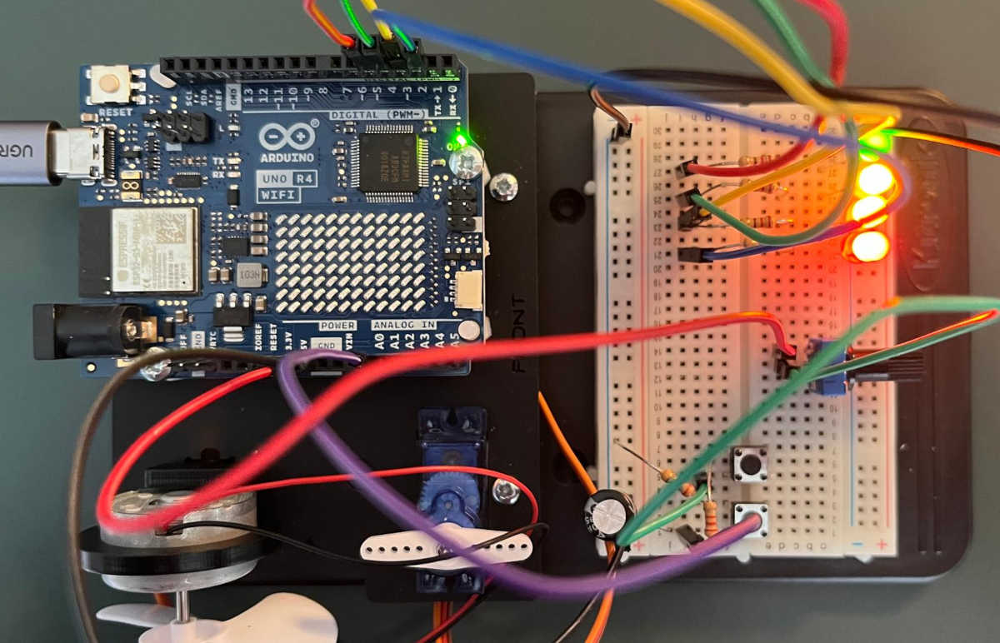

# My experiments with Kitronik's Inventor's Kit

My slightly modified version of the code for each experiment are provided in the `Exp??/` folders. All code was tested on an Arduino UNO R4 WiFi and appears to work correctly. However, note the following:

**Experiment 03:** The experiment was not working correctly, and I found out that changing the last line of code from `digitalWrite(LEDDrivePin, LOW);` to `analogWrite(LEDDrivePin, LOW);` fixed the problem.

**Experiment 09:** The `if()` statements in the LED switch on/off blocks, in the `loop()` function, had missing outer brackets. This was incorrect and the code would not compile. Adding the outer brackets fixes the problem.

**Experiment 10:** The RGB LED diagram in the book appears incorrect. The LED legs map to red, common, green, and blue; and NOT to red, common, blue, and green, as indicated in the book. This means you need to swap the jump cables connected to digital pins 11 and 10. Also, Kitronik's version of the code uses increments of 5 over the 0 to 255 input range for the green and red legs. This means you have to click each button over 50 times to go from 0 to 255. My modified code uses a step of 25, so you don't have to click so much.

_Experiment 10: Use LEDs to show charge in a capacitor_

